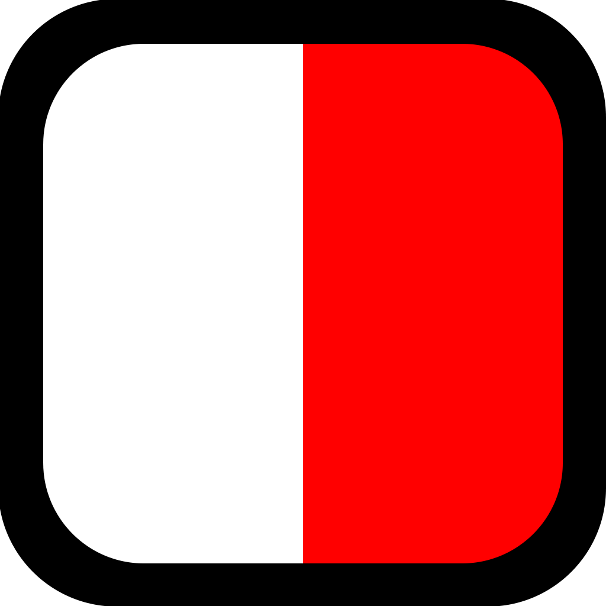

<h1 class="center-text"> Welcome to the PilotDispatch App Documentation Site </h1>

<blockquote>
Welcome to the PilotDispatch App Documentation. Here you'll find everything you need to know to create new features or develop pages off of existing features!
</blockquote>

### What is the PilotDispatch Mobile App
The PilotDispatch Mobile app is a project being worked on by CoeSolutions to create a companion mobile app to the desktop PilotDispatch software. It is made with Flutter and releases to both Apple and Android devices. 

### Where do I start
Most likeley you will want to create a new page based on prexisting code. Please head over to the [**Create a New Screen Demo**](./tutorials/create_a_screen/index) to be taken through step by step in how you can create a new screen. If you would like to create a new release to stores, please check out the [**Create a New Release Demo**](./tutorials/create_a_release/index).
